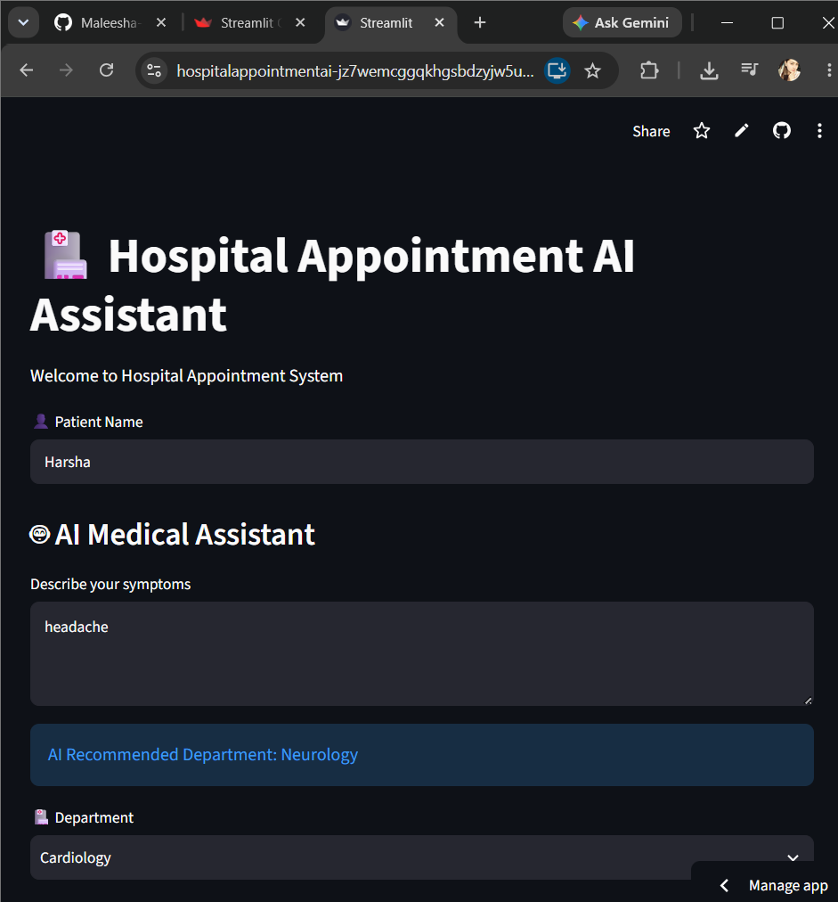
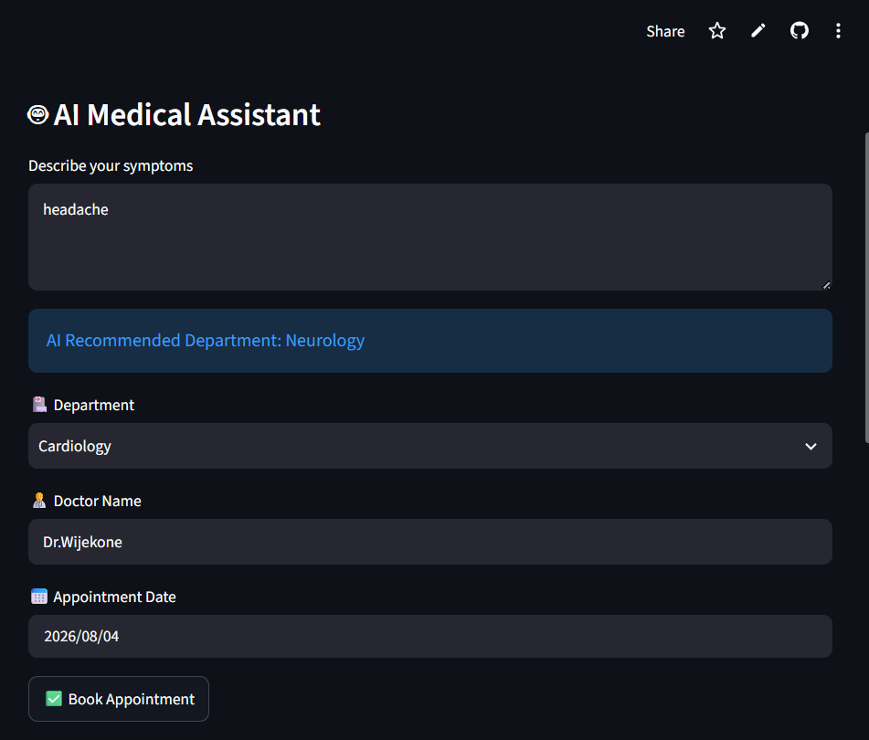
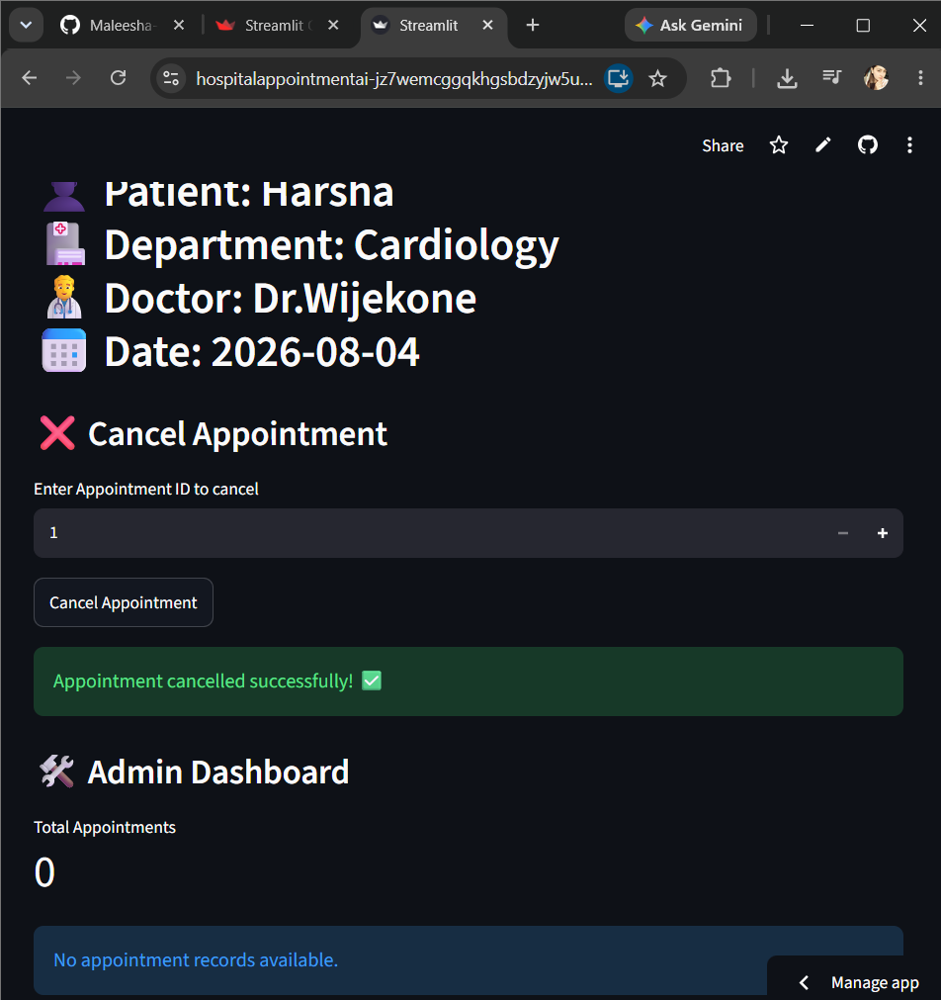

# 🏥 Hospital Appointment AI Assistant

An AI-powered hospital appointment management system developed using **Python and Streamlit**. This application helps patients book appointments, receive basic symptom-based department recommendations, and manage healthcare appointments through a simple and user-friendly interface.

## 📌 Project Overview

The **Hospital Appointment AI Assistant** is designed to simplify the hospital appointment process by providing an interactive platform where patients can enter their details, select departments and doctors, and schedule appointments efficiently.

The system also includes an AI-based medical assistant feature that provides basic recommendations based on user-entered symptoms.

---

# ✨ Features

## 👤 Patient Appointment Booking

* Enter patient information
* Select medical department
* Choose available doctor
* Select appointment date
* Store appointment details securely

## 🤖 AI Medical Assistant

* Accepts patient symptoms as input
* Provides basic department recommendations
* Helps users identify the appropriate medical service

## 📋 Appointment History

* View previously booked appointments
* Maintain appointment records using a database

## 🏥 Department Management

Supported departments include:

* Cardiology
* Neurology
* Dental
* General Medicine

## 🛠 Admin Dashboard

* Monitor appointment records
* Manage hospital appointment information

## ❌ Appointment Cancellation

* Allows users to cancel scheduled appointments

---
# 🖥 Application Screenshots

## Application Page



## AI Medical Assistant



## Admin Dashboard


---

# 🛠 Technologies Used

### Programming Language

* Python

### Framework

* Streamlit

### Database

* SQLite

### Libraries

* Pandas
* Datetime
* SQLite3

### Development Tools

* Visual Studio Code
* Git & GitHub

---

# ⚙️ Installation & Setup

Follow these steps to run the project locally.

## 1. Clone the Repository

```bash
git clone https://github.com/Maleesha-2001/Hospital_Appointment_AI.git
```

## 2. Navigate to Project Folder

```bash
cd Hospital_Appointment_AI
```

## 3. Create Virtual Environment

```bash
python -m venv venv
```

## 4. Activate Virtual Environment

Windows:

```bash
venv\Scripts\activate
```

## 5. Install Required Packages

```bash
pip install -r requirements.txt
```

## 6. Run the Application

```bash
streamlit run app.py
```

The application will open in your browser:

```
http://localhost:8501
```

---

# 📂 Project Structure

```
Hospital_Appointment_AI
│
├── app.py
├── requirements.txt
├── hospital.db
├── README.md
│
└── screenshots
    ├── home.png
    ├── ai_assistant.png
    └── appointment_booking.png
```

---

# 🚀 Future Improvements

Future versions of this project can include:

* Integration with advanced AI medical chatbots
* Real-time doctor availability checking
* Online payment integration
* Email/SMS appointment notifications
* Patient login and authentication system
* Cloud database integration
* Machine learning based disease prediction
* Voice-based AI medical assistant

---

# 👩‍💻 Developer

**Maleesha Nethmini**

BSc (Hons) Information Technology

---

# 📄 License

This project is developed for educational and research purposes.
